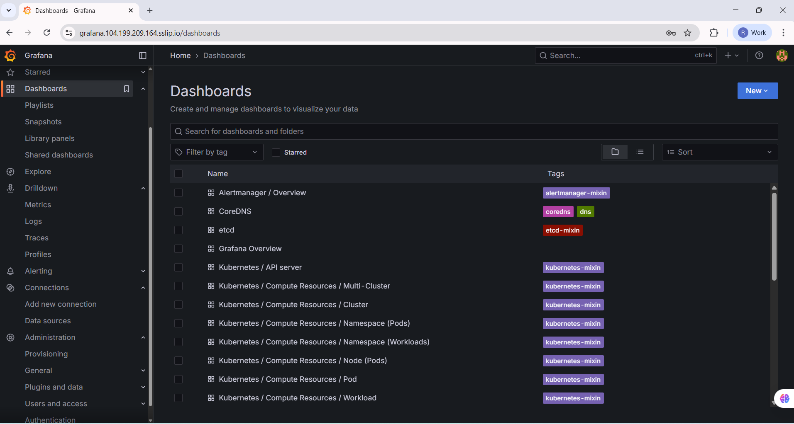
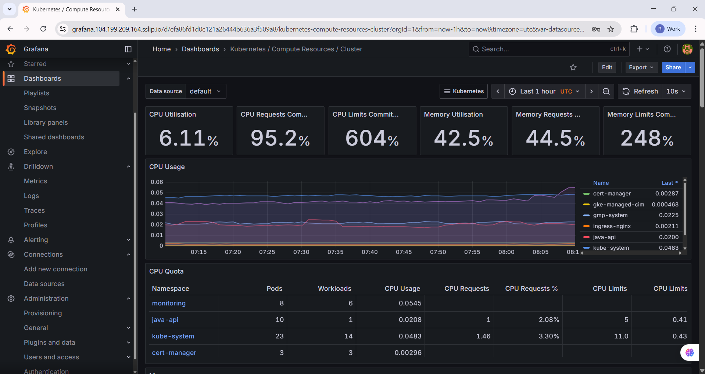

# Java Spring Boot API Deployment on GKE with Ingress & HTTPS

## 1. Project Overview
This project demonstrates deploying a containerized **Java Spring Boot API** to **Google Kubernetes Engine (GKE)** with:
- Docker-based containerization
- Image hosting in **Google Artifact Registry**
- Kubernetes manifests (ConfigMap, Secrets, Deployment, Service, Ingress)
- HTTPS support via sslip.io
- **Horizontal Pod Autoscaling (HPA)** for scalability

---

## 2. Prerequisites
Ensure you have the following:

### Google Cloud Setup
- **Google Cloud Project** with:
  - Artifact Registry API enabled
  - Kubernetes Engine API enabled
  - Compute Engine API enabled

### Local Tools Installed
- [Docker](https://docs.docker.com/get-docker/)
- [kubectl](https://kubernetes.io/docs/tasks/tools/)
- [gcloud CLI](https://cloud.google.com/sdk/docs/install)

### Authenticate with GCP
Run the following commands:
```bash
gcloud auth login
gcloud config set project betbazar-ops


```
## 3. Project Structure

```
api/
├── Dockerfile
├── src/                  # Spring Boot source code
├── pom.xml               # Maven build file
└── k8s/                  # Kubernetes manifests
    ├── 01-configmap.yaml
    ├── 02-secrets.yaml
    ├── 03-deployment.yaml
    ├── 04-service.yaml
    ├── 05-ingress.yaml
    └── 06-hpa.yaml
```

---

## 4. Setup Instructions

### 4.1 Build & Push Docker Image

```bash
docker build -t us-central1-docker.pkg.dev/betbazar-ops/java-api-repo/java-api:latest .
docker push us-central1-docker.pkg.dev/betbazar-ops/java-api-repo/java-api:latest
```


### 4.2 Deploy to GKE

```bash
kubectl create namespace java-api
kubectl apply -f k8s/01-configmap.yaml
kubectl apply -f k8s/02-secrets.yaml
kubectl apply -f k8s/03-deployment.yaml
kubectl apply -f k8s/04-service.yaml
kubectl apply -f k8s/05-ingress.yaml
kubectl apply -f k8s/06-hpa.yaml
```

---

## 5. Verification & Testing

### 5.1 Check Running Pods

```bash
kubectl get pods -n java-api
```


### 5.2 Test API via Ingress (HTTPS)

```bash
curl -k https://api.104.199.209.164.sslip.io/health
```

Expected Output:

```json
{
  "status": "UP",
  "timestamp": "Mon Aug 11 11:53:26 UTC 2025"
}
```


```bash
curl -k https://api.104.199.209.164.sslip.io/users
```

Expected Output:

```json
[
  {
    "email": "john@example.com",
    "name": "John Doe",
    "id": 1
  },
  {
    "email": "jane@example.com",
    "name": "Jane Smith",
    "id": 2
  }
]
```


### 5.3 Test via Browser

Open:

```
https://api.104.199.209.164.sslip.io/health
```


```
https://api.104.199.209.164.sslip.io/api/users
```


---

## 6. Horizontal Pod Autoscaler

```bash
kubectl get hpa -n java-api
```


HPA is configured to:

* Min Replicas: 3
* Max Replicas: 10
* Target CPU Utilization: 70%
* Target Memory Utilization: 80%

---


## 7. Monitoring with Prometheus & Grafana

### 7.1 Setup

Monitoring is implemented using **Prometheus Operator** and **Grafana** via the [kube-prometheus-stack Helm chart](https://artifacthub.io/packages/helm/prometheus-community/kube-prometheus-stack).

**Installation:**

```bash
# Add Helm repo
helm repo add prometheus-community https://prometheus-community.github.io/helm-charts
helm repo update

# Create monitoring namespace
kubectl create namespace monitoring

# Install Prometheus + Grafana stack
helm install monitoring prometheus-community/kube-prometheus-stack -n monitoring
```

### 7.2 Grafana Access via Ingress

An Ingress resource is created for Grafana using `sslip.io` DNS mapping:

```bash
kubectl apply -f k8s/grafana-ingress.yaml
```

Ingress URL:

```
https://grafana.104.199.209.164.sslip.io
```



### 7.3 Login Credentials

Default Grafana credentials:

* **User:** `admin`
* **Password:** Retrieved from Kubernetes secret:

```bash
kubectl get secret monitoring-grafana -n monitoring -o jsonpath="{.data.admin-password}" | base64 --decode
```

### 7.4 Prometheus Integration in Grafana

Prometheus service:

```
monitoring-kube-prometheus-prometheus.monitoring.svc.cluster.local:9090
```

Configured in Grafana under:

```
Settings → Data Sources → Add data source → Prometheus
```


### 7.5 Dashboards

* **Kubernetes Cluster Monitoring** — Nodes, Pods, CPU, Memory usage
* **API Service Metrics** — Request rate, latency, error rates (via `Spring Boot Actuator` + `micrometer`)




---


## 8. Customizations & Issues

* **Probes Tuned:** Increased `initialDelaySeconds` for liveness/readiness to avoid startup failures.
* **DNS Simplification:** Used sslip.io instead of registering a custom domain.
* **HTTPS:** Enabled via GKE Ingress with auto-managed certificate.
* **Scaling:** Configured CPU & Memory-based autoscaling.

---

## 9. Cleanup

To remove resources:

```bash
kubectl delete namespace java-api
```

---

## 10. Deliverables Checklist

* ✅ **Source Code:** Java Spring Boot app + Dockerfile
* ✅ **Kubernetes Manifests:** ConfigMaps, Secrets, Deployment, Service, Ingress, HPA
* ✅ **Documentation:** This README + screenshots
* ✅ **Testing Evidence:** curl and browser outputs
* ✅ **Bonus:** HTTPS, autoscaling


